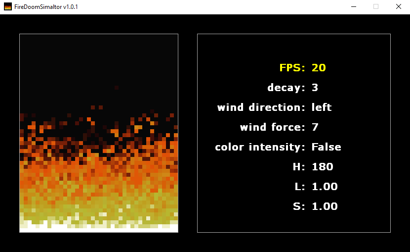
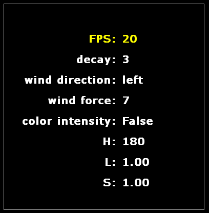
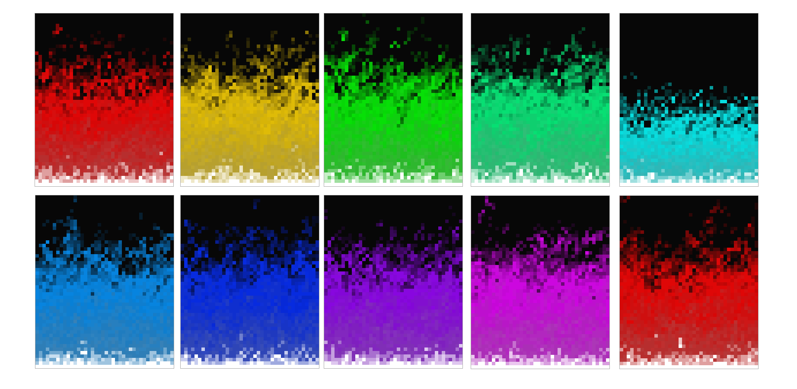

<p align="center">
  <h1>🔥 Fire Doom Simulator 🔥</h1>
  <h6>by <i>FranciscoCharles</i></h6>
</p>

An interactive Doom fire simulator with a simple options menu developed in **Python** + **Pygame**. In this project it is possible to change the amount of fps, flame decay, wind direction, wind force and make it possible to change the colors of the flames in the **`HSL`**_(hue, saturation, lightness)_ color space, in addition to allowing to turn on/off the flames.

<p align="center">
    
</p>

# <a name=index>Table of contents 📚</a>

- [**Options menu**](#menu)
- [**how to use the options menu?**](#using_menu)
- [**Example of possible colors for the flames**](#example)
- [**how can i run?**](#run)
- [**honorable mention**](#honorable_mention)
- [**Dependencies**](#dependencies)
- [**version**](#version)

# **<a name=menu>Options menu 🧰⚙️</a>** <h6>[back to indice](#index)</h6>

<p align="center">
  
</p>

The program has 8 adjustable options and allows you to use the `Q` key to turn the fire on/off. The options currently available are:

- **FPS**:
  + option to control the SPF, ranging from 10 to 60.
- **decay**:
  + option to control the intensity with which the flames lose strength, varying from 1 to (1-amount of colors available in the color palette).
- **Wind direction**:
  + option to control the wind direction, having 3 modes: `right`, `left` and `both`.
- **wind force**:
  + option to control the wind force, ranging from 0 to 10.
- **color intensity**:
  + control option to change the color palette, varies from `True` to `False`.

The options below can only be changed if **`color intensity`** is `True`.

- **H**:
  + option to control the H component (hue) of the color, ranging from 0 to 360.
- **S**:
  + option to control the S component (saturation) of the color, ranging from 0.0 to 1.0.
- **L**:
  + option to control the L component (brightness) of the color, ranging from 0.0 to 1.0

# **<a name=using_menu>How to use the options menu 🕹️</a>**  <h6>[back to indice](#index)</h6>

- use `ESC` to exit/close the program.
- use `Q` to turn the flames on/off 🔥.
- use `W` or: arrow_up: to select the menu above.
- use `Z` or: arrow_down: to select the menu below.
- use `S` or: arrow_right: to increase / change the value of the selected menu.
- use `A` or: arrow_left: to decrement / change the value of the selected menu.

# **<a name=example>Example of possible colors for the flames 🎨</a>** <h6>[back to indice](#index)</h6>

The image below is a demonstration of the colors that are possible for the flames.

<p align="center">
  
</p>

# **<a name=run>How can I run? 🧠💭</a>** <h6>[back to indice](#index)</h6>

Download the project, enter the `src` folder and execute:
```bash
python main.py
```
# **<a name=honorable_mention>Honorable mention 🥇</a>** <h6>[back to indice](#index)</h6>

This project is based on a <a href="https://youtu.be/fxm8cadCqbs" title="go to the Dechamps video tutorial">video</a> from <a href="https://github.com/filipedeschamps"  title="Dechamps github profile">@filipedeschamps</a> , where he brings a doom fire algorithm that he implemented, in the video he explains how the algorithm works in a didactic, practical and simple way. My thanks for sharing your knowledge, diverse and fun content.

# **<a name=dependencies>Dependencies</a>**  <h6>[back to indice](#index)</h6>
- **Pygame** == **1.9.6**.
- **Python** == 3.7 or higher.

# **<a name=version>Version</a>**  <h6>[back to indice](#index)</h6>
- current version of the project: 1.0.1.
---

<p align="center">
    Copyright © 2021 <b>FranciscoCharles</b>
</p>